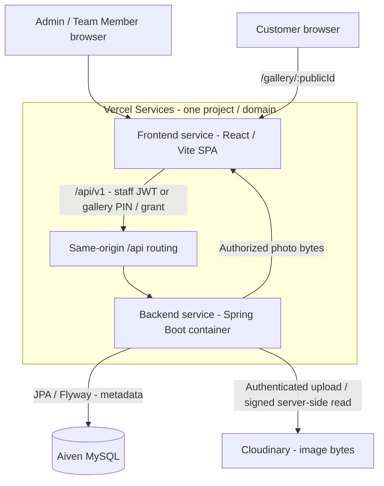
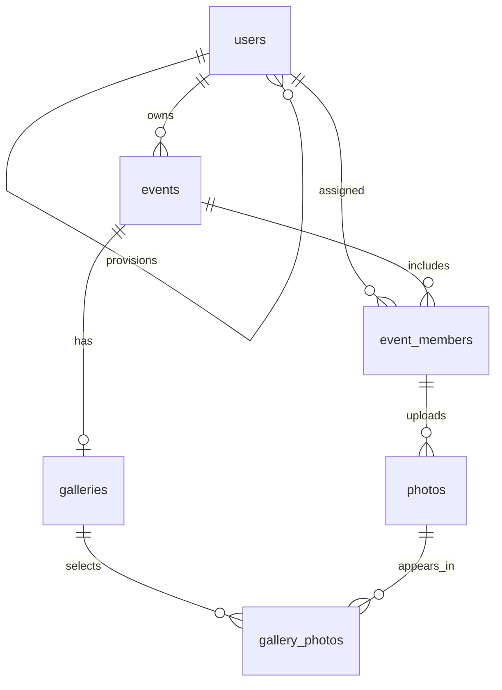

# PhotoShare

PhotoShare is an event photo-sharing application built for the TrizenAI Full-Stack Internship Challenge. Team Members upload photographs, an Admin selects and publishes a gallery, and customers view the selected photos through a stable link and PIN without creating an account.

- **Live Application:** [PhotoShare](https://photo-sharing-platform-8mkm.vercel.app)
- **GitHub Repository:** [Ayush-Raj178/photo-sharing-platform](https://github.com/Ayush-Raj178/photo-sharing-platform)
- **Production Health:** [GET /api/health](https://photo-sharing-platform-8mkm.vercel.app/api/health)
- **Backend tests:** 34/34 passing
- **Frontend tests:** 11/11 passing

Test and production evidence is described below; automated tests and live checks are separate.

## Demo Access

Dedicated evaluator demo accounts are prepared for the TrizenAI review.

| Access | Email or URL | Password / PIN |
| --- | --- | --- |
| Admin | `admin@photoshare-demo.example.com` | Provided in submission email |
| Team Member 1 | `team1@photoshare-demo.example.com` | Provided in submission email |
| Team Member 2 | `team2@photoshare-demo.example.com` | Provided in submission email |
| Published Gallery | [Open demo gallery](https://photo-sharing-platform-8mkm.vercel.app/gallery/41e674428df0fb5b6f30df8059f80a58) | PIN provided in submission email |

Demo passwords and the gallery PIN are provided privately in the internship submission email and are intentionally excluded from the public repository. The demo emails are login identifiers, not monitored inboxes.

The main `TrizenAI Demo Event` contains 30 uploaded images from two Team Members, with 18 published and 12 left unselected, so reviewers can immediately test pagination, search, uploader filtering, selection filtering, and gallery access.

## Core Workflow

**Admin → Event → Team Member → Upload → Admin Selection → Publish → Gallery Link + PIN → Customer**

1. The Admin registers or logs in, creates an event, and assigns Team Members.
2. A Team Member logs in, opens an assigned event, and uploads multiple photos.
3. The Admin reviews the event photos, creates its gallery, selects photos, and sets a six-digit PIN.
4. Publishing returns a stable gallery URL. Re-publishing can update the selection and PIN while retaining that URL.
5. The customer opens the link, enters the PIN, and views only the published selection.

## Features

### Admin

- Register and log in; create and manage access to owned events.
- Provision Team Members or assign previously provisioned members to an event.
- View all ready photos in owned events and select gallery photos.
- Configure the gallery PIN; publish and re-publish with a stable share link.

### Team Member

- Log in and view assigned events.
- Upload multiple JPEG/PNG photos with per-file results and manual retry for failures.
- View only their own uploaded photos within assigned events; gallery management is restricted to Admins.

### Customer

- Open the gallery link without an account and unlock it with the PIN.
- Browse only selected, ready photos in a published, unexpired gallery.

### Bonus features

- Server-side photo pagination with **Load more** in staff and customer views.
- Admin photo search by filename and filters by uploader and saved gallery selection (selected/unselected).
- Optional gallery expiration, checked when unlocking and on subsequent gallery/content requests.
- Cloudinary-backed authenticated image storage and delivery.

Multi-photo upload is included in the core workflow and is also a mandatory challenge requirement.

## Technology Stack

| Layer | Technologies |
| --- | --- |
| Backend | Java 17, Spring Boot 4.1.1, Maven, Spring Security, JWT, Spring Data JPA, Bean Validation |
| Frontend | React 19.2.8, Vite 8.2.2, Tailwind CSS 4.3.3, React Router, Axios, Lucide React |
| Database | MySQL, Flyway 12.4.0 migrations |
| Credentials and storage | Argon2 hashing, Cloudinary authenticated assets |
| Testing | JUnit, Spring Boot/MockMvc, H2 for isolated backend tests; Vitest, React Testing Library; Playwright journey specs |
| Hosting | Vercel Services, Aiven MySQL, Cloudinary |

Versions come from the backend Maven configuration and frontend package manifest.

## System Architecture

One Vercel Services project serves the React SPA and a Spring Boot container on the same public domain. The backend is a modular monolith organized around authentication, events, photos, and galleries.



The browser sends API requests after loading the SPA. Customer PIN verification issues a gallery-specific grant; the backend checks it before returning gallery data or image bytes. MySQL and Cloudinary are separate backend dependencies: MySQL stores metadata, while Cloudinary stores the files. Provider credentials and signed delivery URLs stay on the backend.

## Database Design

| Table | Purpose and relationships |
| --- | --- |
| `users` | Admin and Team Member accounts with hashed passwords. `provisioned_by` links a Team Member to the Admin who created the account. |
| `events` | Event details; `owner_id` identifies the owning Admin. |
| `event_members` | Assignment join table between events and Team Members; composite key `(event_id, user_id)`. |
| `photos` | Metadata: event, uploader, filename, storage key, type, size, dimensions, timestamps, and `PENDING`/`READY`/`FAILED` status. The event/uploader pair references an assignment. |
| `galleries` | At most one gallery per event, with draft/published state, PIN hash/version, stable share token, publication time, and optional expiration. |
| `gallery_photos` | Ordered selection joining a gallery to its photos. Composite foreign keys keep the gallery and selected photos in the same event. |



Photo bytes are **not stored in MySQL**. Production uses external Cloudinary assets; local development can use a private filesystem directory. Flyway applies [schema creation](backend/src/main/resources/db/migration/V1__create_core_schema.sql) and [gallery expiration](backend/src/main/resources/db/migration/V2__add_gallery_expiration.sql); Hibernate validates the resulting schema.

## Security & Access Control

- **Credentials:** account passwords and gallery PINs are hashed with Argon2.
- **Staff authentication:** bearer JWTs with role, issuer, audience, and expiration checks. Admin ownership and Team Member assignment checks run on the backend.
- **Photo access:** Admins can read ready photos in owned events; Team Members can read only their own uploads in assigned events.
- **Gallery access:** a correct PIN issues a separate gallery JWT, valid for 15 minutes by default. Each request checks the gallery, PIN version, publication state, and expiration. Changing the PIN invalidates previously issued gallery grants.
- **Private images:** Cloudinary assets use authenticated delivery. Protected backend routes retrieve and return bytes after authorization; customer content requests also check that the photo belongs to the published selection. Unselected photos return `404` through customer content routes.
- **Input and errors:** request validation, filename sanitization, JPEG/PNG content checks, file/batch/pixel limits, per-file upload failures, and structured API errors.
- **Request controls:** configurable rate limits for login, registration, PIN attempts, and member provisioning. CORS uses the configured origin list; production API requests are same-origin.

## API Overview

Production API base: `/api/v1`. Staff routes use a staff bearer token; public gallery reads use the separate grant returned after PIN verification.

| Route or route group | Purpose |
| --- | --- |
| `/api/v1/auth` with `/register`, `/login`, `/me` | Admin registration, staff login, and current account |
| `/api/v1/events` and `/{eventId}` | Create events and read owned/assigned events |
| `/api/v1/events/{eventId}/members`; `/api/v1/team-members` | Provision/assign members and list the Admin's members |
| `/api/v1/events/{eventId}/photos` | Multipart upload and paginated photo listing |
| `/api/v1/events/{eventId}/photos/{photoId}` and `/content` | Photo metadata and protected image bytes |
| `/api/v1/events/{eventId}/galleries` | Create/list the event gallery |
| `/api/v1/events/{eventId}/galleries/{galleryId}` with `/photos`, `/pin`, `/expiry`, `/publish` | Read/configure the gallery and publish/re-publish |
| `/api/v1/public/galleries/{shareToken}/access` | Verify PIN and issue gallery access |
| `/api/v1/public/galleries/{shareToken}` and `/photos/{photoId}/content` | Read the authorized gallery and selected images |
| `/api/health` | Public health response: `{"status":"UP"}` |

## Local Development

### Prerequisites

- Java 17 and Maven.
- Node.js 22.12+ and npm, compatible with the installed Vite version.
- A running MySQL server, an existing database, and an application user with migration permissions.
- Cloudinary credentials only when using the `cloudinary` storage driver. Docker is not required for local development.

Clone the repository and enter it:

```sh
git clone https://github.com/Ayush-Raj178/photo-sharing-platform.git
cd photo-sharing-platform
```

### Backend

Set `DB_JDBC_URL`, `DB_USERNAME`, `DB_PASSWORD`, and the two JWT signing keys in the shell that starts Maven. Use separate Base64-encoded keys, each representing at least 32 random bytes, and keep them stable across restarts.

For local filesystem storage, set `PHOTOSHARE_STORAGE_DRIVER=local` (the default); optionally set `LOCAL_STORAGE_ROOT` to a persistent private directory. For Cloudinary, set `PHOTOSHARE_STORAGE_DRIVER=cloudinary` and its three credentials.

```sh
cd backend
mvn spring-boot:run
```

The backend defaults to `http://localhost:8080`; check `/api/health`. Flyway migrates the configured database on startup. The backend does **not** automatically load the root `.env` file. Use the normal application configuration for manual development, not the in-memory test configuration. The [Windows local startup guide](docs/LOCAL_DEVELOPMENT.md) includes PowerShell-specific setup details.

### Frontend

In a second terminal, from the repository root:

```sh
cd frontend
npm ci
npm run dev
```

Open `http://localhost:5173`, matching the backend's default CORS origin. The API base defaults to `http://localhost:8080/api/v1`; override it in `frontend/.env.local` using `VITE_API_BASE_URL`. Restart Vite after changing it.

## Environment Variables

Set backend secrets in your local shell or Vercel environment settings. Only the public API base belongs in frontend configuration; never expose secrets through `VITE_` variables. The authoritative backend inventory is [application.yml](backend/src/main/resources/application.yml).

| Variable | Purpose / placeholder or default |
| --- | --- |
| `DB_JDBC_URL` | MySQL JDBC URL, e.g. `jdbc:mysql://<host>:<port>/<database>`; configure TLS for Aiven |
| `DB_USERNAME`, `DB_PASSWORD` | Database application credentials |
| `STAFF_JWT_SECRET_BASE64` | `<base64-of-at-least-32-random-bytes>` |
| `GALLERY_JWT_SECRET_BASE64` | `<different-base64-signing-key>` |
| `PHOTOSHARE_STORAGE_DRIVER` | `local` by default; **`cloudinary` in production** |
| `CLOUDINARY_CLOUD_NAME`, `CLOUDINARY_API_KEY`, `CLOUDINARY_API_SECRET` | Values from the same Cloudinary product environment; required for `cloudinary` |
| `APP_ALLOWED_ORIGINS` | Comma-separated allowed origins; default `http://localhost:5173`; production uses the live application origin |
| `FRONTEND_ORIGIN` | Origin used to build share links; default `http://localhost:5173`; production uses the live application origin |
| `PORT` | Backend port, default `8080`; supplied by Vercel in production |
| `VITE_API_BASE_URL` | Frontend build/dev setting: `http://localhost:8080/api/v1` locally, `/api/v1` in production |
| `JWT_ISSUER` | Default `photoshare` |
| `STAFF_JWT_TTL_SECONDS`, `GALLERY_GRANT_TTL_SECONDS` | Default `900` seconds each |
| `LOCAL_STORAGE_ROOT` | Local driver only; default `./local-storage`, relative to the backend working directory |
| `MAX_FILE_SIZE_BYTES` | Default `10485760` (10 MiB) |
| `MAX_REQUEST_SIZE_BYTES` | Default `220200960` (210 MiB) |
| `MAX_FILES_PER_UPLOAD`, `MAX_IMAGE_PIXELS` | Default `20` files and `40000000` decoded pixels per image |
| `RATE_LIMIT_WINDOW_SECONDS` | Default `300` seconds |
| `LOGIN_RATE_LIMIT_ATTEMPTS`, `LOGIN_RATE_LIMIT_IP_ATTEMPTS` | Default `10` per account/IP combination and `50` per IP per window |
| `PIN_RATE_LIMIT_ATTEMPTS`, `PIN_RATE_LIMIT_IP_ATTEMPTS` | Default `5` per gallery/IP combination and `50` per IP per window |
| `REGISTRATION_RATE_LIMIT_ATTEMPTS` | Default `5` per IP per window |
| `MEMBER_PROVISION_RATE_LIMIT_ATTEMPTS` | Default `20` per Admin per window |

`STORAGE_DRIVER` is a legacy fallback in configuration. Use `PHOTOSHARE_STORAGE_DRIVER` for Vercel production.

## Testing

Verified baseline: **34 backend tests and 11 frontend tests passing**, with successful backend and frontend builds.

| Critical area | Implemented test coverage |
| --- | --- |
| Authentication and authorization | Password length validation, authentication requirements, event ownership/assignment, Team Member restrictions, frontend session restoration and route protection |
| Photo access control | Own-upload isolation, cross-event denial, unpublished/unselected photo protection, metadata-only storage, invalid file rejection |
| Gallery publishing | Photo selection, publish/re-publish, stable share link, cross-event selection rejection, Team Member denial |
| PIN verification | Wrong PIN rejection, correct PIN grant, cross-gallery grant denial, PIN-change invalidation, expiration checks |
| Storage failure and protected reads | Partial upload failure, cleanup outcomes, authenticated Cloudinary upload/signing, protected retrieval, provider failures, sanitized diagnostics |
| Bonus features | Database pagination and filters, gallery expiration, frontend Load more and filter/expiration controls |

Run from `backend/`:

```sh
mvn verify
```

Run from `frontend/` after `npm ci`:

```sh
npm test
npm run build
```

Backend tests use isolated H2 and local/mocked/loopback storage fixtures. They do not establish real Aiven or Cloudinary behavior; the production checks below provide separate evidence. Frontend counts refer to Vitest tests. Additional browser journeys are in [frontend/e2e](frontend/e2e); run `npm run e2e` from `frontend/` with both local servers running and Chrome installed, as configured in [playwright.config.js](frontend/playwright.config.js).

## Deployment

Production uses **one Vercel Services project** with a React/Vite frontend service and a Spring Boot container backend service, backed by **Aiven MySQL** and **Cloudinary**.

1. Prepare the Aiven database/user and Cloudinary product environment. Keep database access and credentials outside the repository.
2. Import this GitHub repository into Vercel with the project root at the repository root. The root [vercel.json](vercel.json) defines both services.
3. Set the environment variables above, including `PHOTOSHARE_STORAGE_DRIVER=cloudinary`, `VITE_API_BASE_URL=/api/v1`, and both origin variables to the production URL.
4. Deploy. The frontend runs `npm run build`; the backend builds with [Dockerfile.vercel](backend/Dockerfile.vercel). Flyway runs at backend startup. If the final domain was assigned during deployment, update both origin variables and redeploy.
5. Check `/api/health`, then verify the Admin → Team Member upload → publish → customer PIN workflow, including direct gallery navigation and negative access cases.

Routing evaluates `/api/*` first and sends it to the backend; remaining routes go to the frontend SPA. The frontend service's catch-all rewrite serves `index.html`, allowing direct navigation and refresh at `/gallery/:publicId`. The fallback is declared in the root service configuration and [frontend/vercel.json](frontend/vercel.json).

See [docs/DEPLOYMENT.md](docs/DEPLOYMENT.md) for the detailed deployment guide and rollback notes. Image bytes and database records persist independently of application deployments.

## Production Verification

The following checks were reported verified for production application commit `e121539bd327c3f328afd3c22b7d120bbe921ed9`, with the Vercel Production deployment **Ready**. This records the application verification baseline; a documentation commit does not repeat those authenticated workflows.

| Check | Result |
| --- | --- |
| Health endpoint | Verified — HTTP 200, `UP` |
| Admin login/register | Verified |
| Event creation and Team Member provisioning | Verified |
| Team Member login and assigned event visibility | Verified |
| Multiple photo upload | Verified |
| Cloudinary authenticated storage and protected read | Verified |
| Admin selection and gallery publish | Verified |
| Stable gallery link and direct browser navigation | Verified |
| Wrong PIN rejected | Verified |
| Correct PIN accepted; selected image rendered | Verified |
| Unselected image inaccessible | Verified — direct customer content request returned 404 |
| Existing uploads persisted across deployments | Verified |

## Known Limitations

- Rate-limit counters are held in backend memory. They reset on restart and are not shared across instances.
- Each event supports one gallery. Multiple independent galleries per event are not implemented.
- Images are served at their stored dimensions; there is no thumbnail or resizing pipeline. Original image reads pass through the backend, increasing transfer and memory costs for large photos.
- Upload retries are manual and do not use idempotency keys. If a response is lost, review the refreshed photo list before retrying to avoid duplicate uploads. Storage cleanup is best-effort; failed cleanup has no background reconciliation worker.
- The health endpoint reports application availability; it does not probe database or Cloudinary connectivity.

## Project Structure

```text
photo-sharing-platform/
├── backend/
│   ├── src/main/java/com/photoshare/   # Auth, events, photos, galleries, security
│   ├── src/main/resources/            # Configuration and Flyway migrations
│   ├── src/test/                      # Backend tests and isolated configuration
│   ├── pom.xml
│   └── Dockerfile.vercel
├── frontend/
│   ├── src/                          # Pages, components, auth, API client, tests
│   ├── e2e/                          # Playwright journeys
│   ├── package.json
│   └── vercel.json
├── docs/                             # Setup, deployment, design, requirement notes
├── vercel.json                       # Shared-domain service routing
└── README.md
```

## Challenge Requirement Mapping

| SRD requirement / deliverable | Implementation |
| --- | --- |
| Admin and Team Member authentication/authorization | Spring Security/JWT, Argon2, role and ownership/assignment checks |
| Event creation and member management | Admin-owned events, member provisioning and event assignments |
| Multiple photo uploads and failure handling | Team Member multipart uploads, per-file outcomes and manual retry |
| Photo metadata and external file storage | MySQL `photos` table; Cloudinary authenticated assets |
| Role-specific photo visibility | Admin event view; Team Member own-upload view; backend-protected reads |
| Gallery selection, publication, and sharing | Ordered selections, publish/re-publish, stable public link |
| PIN-protected customer access without registration | PIN gate, gallery-specific grant, published-selection checks |
| Frontend application | React staff workspaces and customer gallery |
| Critical tests | Authentication/authorization, photo access, publishing, and PIN tests in the Testing section |
| Source code and README | Linked GitHub repository and this document |
| Architecture / database explanation | System Architecture and Database Design, including Mermaid diagrams and migration links |
| Local setup and environment variables | Local Development and Environment Variables sections |
| Live application and deployment | Linked production app, Vercel Services, Aiven MySQL, Cloudinary, and deployment guide |
| Demo credentials | Dedicated demo account emails and gallery link in Demo Access; passwords and PIN shared privately with the submission |
| Deployment steps and known limitations | Deployment and Known Limitations sections |

## License

This project is licensed under the MIT License. See [LICENSE](LICENSE) for details.

## Author

Ayush Raj
