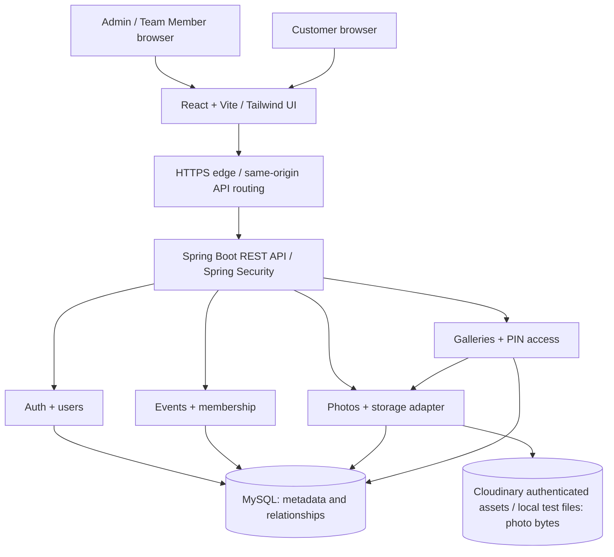

# Architecture

Status: backend/frontend components and local/Cloudinary storage adapters are implemented; real production-service and deployment verification remain pending. Supports ARCH-01, DOC-01, DOC-03 and the functional/security IDs in the [register](project-requirements.md).

## Components and responsibilities

React + Vite renders staff screens and the public PIN/gallery flow. Tailwind provides responsive styling. The browser uses REST JSON and multipart upload requests; it does not decide access rights or receive database/storage credentials.

One Spring Boot service hosts controllers, domain services, repositories, Spring Security, and a storage adapter. MySQL stores users, event ownership/membership, photo metadata, and gallery selections. A private object storage service stores photo bytes. An HTTPS reverse proxy serves the frontend and routes /api to the backend on the same origin in production.

The diagram reflects the implemented application boundaries. No cloud deployment infrastructure has been created.

## Backend modules

- auth: Admin registration, staff login, password hashing, staff JWT issuance/validation.
- users: safe user DTOs and Admin-owned member provisioning/roster. No global directory or generic role-change endpoint.
- events: event creation, owner-scoped event lookup, member assignment, assigned-event queries.
- photos: file validation, upload state, metadata, own/all-event photo visibility, authorized image reads.
- storage: narrow put/read/delete operations behind a provider-neutral interface, random object keys, compensating cleanup.
- galleries: one gallery per event, draft selection/PIN, atomic publish or re-publish, stable unguessable share token, PIN verification/rotation, gallery-scoped grants, authorized public image reads.
- shared: structured errors, request IDs, validation helpers, clock/configuration; no generic service framework.

Use packages by module with controller -> service -> repository/adapter boundaries. Cross-module calls go through services. Authorization belongs at the service/query boundary as well as route-level role checks. Separate request/response DTOs from persistence entities.

## Request and data flows

1. Registration/login: validate input, hash/verify password, issue short-lived staff JWT. Later requests validate JWT and load the user and current event ownership/membership.
2. Event/membership: authenticated Admin creates an owned event, provisions a Team Member in their roster or assigns an existing roster member. Team queries join EventMember by authenticated user ID.
3. Upload: check event membership before reading/storing content; validate bounded files; allocate a metadata record and unique key; write private bytes; mark the row READY. Failures are recorded and compensated as described in [storage-design.md](storage-design.md).
4. Review/selection: owner sees all READY event photos; member sees own READY photos only. Gallery service verifies every selected photo belongs to that event and is READY.
5. Publish/re-publish: lock the gallery, validate the complete selection and PIN state, then replace the published set and publication time in one MySQL transaction. The same random share token keeps the URL stable. If the PIN changes, increment its internal version to invalidate older gallery grants; the PIN is never embedded in the link.
6. Customer: link opens a PIN gate without photo metadata. Correct PIN issues a scoped access grant. Gallery and image requests verify the grant, published state, and selection membership; the backend reads private bytes and streams them with private/no-store cache headers.

## Transactions and failure boundaries

MySQL transactions protect membership uniqueness, same-event relationships, draft edits, publication, and re-publication. Use a gallery row lock so draft mutation and atomic replacement cannot interleave. Do not hold a database transaction open during object storage network transfers.

Object storage and MySQL cannot commit atomically. Keep PENDING/READY/FAILED photo states and a compensating deletion path, with reconciliation for stale pending records and orphaned objects. Only READY records may be viewed or selected. No message broker is required; a bounded maintenance command/job can be added during implementation.

## Minimal operational scope

One API deployment, one relational database, one Cloudinary product environment, and a static UI. No microservices, browser-direct CDN delivery, queue, image transformation pipeline, cache cluster, search engine, or CI/CD system is required for core scope. Logging must omit secrets and image content. Supported application versions are recorded in [PROJECT_CONTEXT.md](PROJECT_CONTEXT.md); deployment commands remain pending until hosting is selected.

Related contracts: [database-design.md](database-design.md), [api-contract.md](api-contract.md), [security-model.md](security-model.md), [DEPLOYMENT.md](DEPLOYMENT.md).
