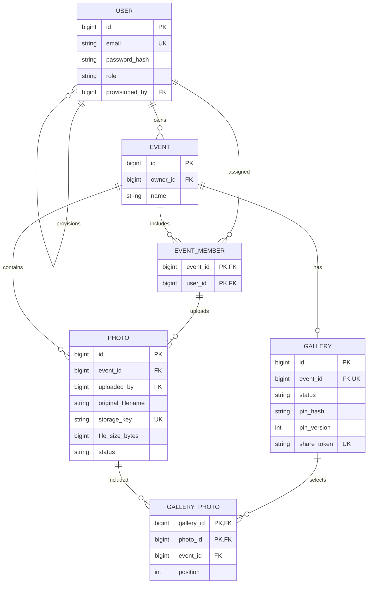

# Planned database design

Status: schema proposal only; no database or migrations created. Supports ARCH-01, PHOTO-05, and the event/gallery access rules. Use MySQL with InnoDB and explicit foreign keys; choose a supported version during implementation. All additional fields/rules below are project design decisions, not claims of exact SRD wording.

## Conventions

Use BIGINT primary keys generated by the database; serialize IDs as decimal strings in JSON to avoid JavaScript integer precision loss. Store UTC timestamps as DATETIME(6), with application/connection timezone fixed to UTC. Required fields are NOT NULL unless marked nullable. Use named constraints and versioned migrations later. Normalize email to lowercase consistently before validation/storage and apply a unique constraint. Use binary/case-sensitive comparison for object keys and share tokens.

No image BLOBs, binary image columns, or base64 photo data belong in MySQL. Password/PIN hashes are encoded strings containing their algorithm parameters and salts, never raw secrets.

## User -> users

- id: BIGINT, PK.
- email: VARCHAR(254), unique normalized login identifier.
- display_name: VARCHAR(100).
- password_hash: VARCHAR(255), encoded salted password hash.
- role: VARCHAR(20), CHECK in ADMIN, TEAM_MEMBER.
- provisioned_by: BIGINT nullable FK -> users.id. NULL for ADMIN; required for TEAM_MEMBER.
- created_at: DATETIME(6).

Constraints: unique email; role/provisioned_by nullability CHECK. The service verifies provisioned_by points to an ADMIN; a plain FK does not enforce role. ADMIN registration always creates ADMIN with no provisioner. Team provisioning fixes TEAM_MEMBER and derives provisioner from the current principal.

Index: (provisioned_by, role, id) for an Admin's roster. No API exposes a global user directory. Initial password is received transiently and stored only as a hash.

## Event -> events

- id: BIGINT, PK.
- owner_id: BIGINT FK -> users.id.
- name: VARCHAR(150).
- description: VARCHAR(2000), nullable.
- created_at: DATETIME(6).

The service verifies owner_id is the current ADMIN. Names need not be globally unique; event date is not required by the SRD and is omitted. Index (owner_id, created_at, id) supports owner event lists.

## EventMember -> event_members

- event_id: BIGINT, PK component, FK -> events.id.
- user_id: BIGINT, PK component, FK -> users.id.
- added_at: DATETIME(6).

Composite PK (event_id, user_id) prevents duplicate assignment. Index (user_id, event_id) supports assigned-event lists. The service verifies user.role = TEAM_MEMBER and user.provisioned_by = event.owner_id before inserting. No membership roles are needed; the owner is recorded on Event and is not an EventMember.

A member can belong to multiple events of the same Admin. Removal is not exposed in the baseline; any future removal must immediately affect access and explicitly address existing Photo references.

## Photo -> photos

- id: BIGINT, PK (SRD Photo ID).
- event_id: BIGINT FK -> events.id (SRD Event ID).
- uploaded_by: BIGINT FK -> users.id (SRD Uploaded By).
- original_filename: VARCHAR(255), sanitized display name (SRD Filename).
- storage_key: VARCHAR(512), unique, case-sensitive opaque object key (SRD Storage Location; bucket/endpoint are configuration).
- content_type: VARCHAR(50), validated image/jpeg or image/png.
- file_size_bytes: BIGINT, positive (SRD File Size).
- width_px, height_px: INT, positive, validated dimensions.
- status: VARCHAR(10), CHECK in PENDING, READY, FAILED.
- created_at: DATETIME(6) (SRD Created At).
- updated_at: DATETIME(6).
- failure_code: VARCHAR(50), nullable, internal non-sensitive failure category.

Composite FK (event_id, uploaded_by) -> event_members(event_id, user_id) ensures that the planned uploader was assigned to that event. All uploads in this baseline come from Team Members. Add UNIQUE (id, event_id) for GalleryPhoto's same-event FK.

Indexes: (event_id, status, created_at, id) for owner review; (event_id, uploaded_by, status, created_at, id) for own-photo queries; (status, updated_at) for recovery. READY requires successful object write and metadata finalization; only READY photos are exposed in lists/content/selection. Exact pixel/byte limits are configurable service validation rather than hard-coded schema limits.

## Gallery -> galleries

- id: BIGINT, PK.
- event_id: BIGINT, unique FK -> events.id (one gallery per event; assumption A-05).
- title: VARCHAR(150).
- status: VARCHAR(10), CHECK in DRAFT, PUBLISHED.
- pin_hash: VARCHAR(255), nullable while DRAFT.
- pin_version: INT, positive once a PIN is set; incremented only when the PIN hash changes.
- share_token: CHAR(32), unique and case-sensitive; 16 cryptographically random bytes encoded as 32 lowercase hex characters.
- created_at: DATETIME(6).
- updated_at: DATETIME(6).
- published_at: DATETIME(6), nullable while DRAFT; time of the latest successful publication/re-publication.
- expires_at: DATETIME(6), nullable; optional customer-access cutoff represented as a UTC instant. Existing rows remain non-expiring.

Add UNIQUE (id, event_id) for composite references. CHECK that pin_version is zero only when pin_hash is NULL and positive when a PIN exists; DRAFT has NULL published_at; PUBLISHED has non-null pin_hash and published_at. A draft may already have a PIN. The service enforces nonempty READY photo selection at publication because a row CHECK cannot count GalleryPhoto records. Gallery ownership is derived from Event.owner_id; avoid redundant owner fields.

Share token identifies a public URL and is never sufficient authorization. The API reveals that URL to staff only after publication. Plaintext PIN is not retained/retrievable. Gallery grants carry pin_version; a PIN rotation invalidates older grants without storing a server-side session list.

`V2__add_gallery_expiration.sql` adds only nullable `galleries.expires_at`; V1 remains unchanged and existing MySQL data is preserved. No expiry index is added because public requests first use the existing unique share-token lookup and Admin requests use the gallery primary/event key; expiration is then checked on that single row.

## GalleryPhoto -> gallery_photos

- gallery_id: BIGINT, PK component.
- photo_id: BIGINT, PK component.
- event_id: BIGINT.
- position: INT, positive, display order set from the Admin's ordered selection.
- selected_at: DATETIME(6).

Composite PK (gallery_id, photo_id) prevents duplicate photos. UNIQUE (gallery_id, position) prevents duplicate ordering positions. Composite FK (gallery_id, event_id) -> galleries(id, event_id), and composite FK (photo_id, event_id) -> photos(id, event_id) prevent cross-event selections at the database level. Index (photo_id, event_id) supports reverse references.

Selected state is membership in GalleryPhoto, not a global Photo.selected flag. This avoids an ambiguous second source of truth. Draft changes and publish/re-publish lock the Gallery row. Delete/reinsert a complete replacement selection within one transaction; leave the old draft or published selection intact on validation failure. Public reads see either the previous complete selection or the newly committed selection, never a partial replacement.

## Relationships

The diagram shows logical entities and key fields; the full field definitions above are authoritative. Composite foreign-key grouping is specified in prose.

## Ownership and retention implications

Use RESTRICT for entity deletion by default; no cascading deletion of photos, events, users, or published galleries is exposed. Reconciliation may delete only proven orphan objects or stale failed/pending upload artifacts, never READY selected content. A future deletion feature needs an explicit storage cleanup/retention design before schema/API changes.

Object read authorization must query current event ownership/membership or current published-gallery membership. Neither numeric IDs, random storage keys, nor a record's existence grant access. Cross-role/cross-event constraints not expressible by simple SQL FKs are enforced by transactional services and verified in tests.

Gallery and staff JWT grants are short-lived and stateless in this baseline; no token/session table is proposed. A PIN rotation immediately invalidates old gallery grants through pin_version. Other individual token revocation relies on short expiry, documented in [security-model.md](security-model.md).
